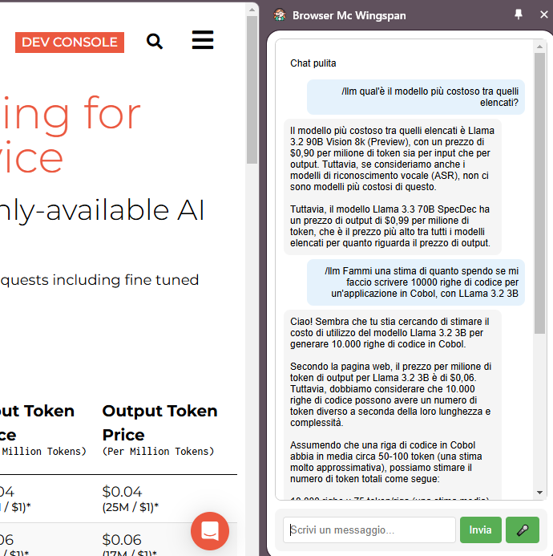

# Bower Vexton

**Bower Vexton**, conosciuto anche come **Browser Mc Wingspan**, è il tuo assistente personale per navigare e interagire con le tue sessioni sul web. 
Questo strumento è progettato per aiutarti nella navigazione dai primi giorni del [Settembre eterno](https://en.wikipedia.org/wiki/Eternal_September),
offrendoti funzionalità avanzate come riassunti, traduzioni e molto altro direttamente dalla tua barra laterale del browser.

Attualmente in fase di test, il sistema utilizza **Groq** e **Cerebras** come modelli di linguaggio (LLM), 
se ne possono integrare a piacere ma questi sono tra i migliori che offrono buone prestazioni 
e un free tier che consente di non sbattersi troppo con configurazioni di server e spese in bolletta.

---

## Installazione

Al momento, l'estensione non è ancora pacchettizzata per una distribuzione ufficiale. Segui questi passaggi per configurarla manualmente:

1. Quando ti verrà chiesto imposta le API KEY (previa registrazione ai loro servizi) nelle variabili apposite, ad esempio:
   * `/set APIKEY_CEREBRAS csk-...` per [Cerebras LLM](https://cerebras.ai/)
   * `/set APIKEY_GROQ csk-...` per [Groq LLM](https://groq.com/)
2. Apri il browser e vai a `chrome://extensions` (per Chrome) o `edge://extensions` (per Edge), etc.  
3. Finché non pubblicherò l'estensione, Abilita la **modalità sviluppatore** (di solito una spunta da qualche parte).
4. Clicca su **Carica estensione non pacchettizzata** e seleziona la cartella del progetto.

---

## Utilizzo

Una volta installata l'estensione, puoi iniziare a utilizzarla immediatamente:

**Apri la sidebar**:
Clicca sull'icona dell'estensione per aprire la barra laterale. Qui potrai interagire con la pagina web corrente.

Puoi usare la chat, ad esempio, per 
**riassumere** il contenuto della pagina,
**tradurre** il testo in altre lingue,
sfogarti, eseguire altre operazioni avanzate.

**Comandi di test**:
Per verificare il funzionamento dell'estensione, puoi utilizzare i seguenti comandi:  
- **/html**: Mostra la lunghezza del codice HTML della pagina corrente.  
- **/text**: Mostra un estratto del testo della pagina.
- **/llm {tua richiesta}**: Chiede al llm di darti informazioni specifiche sulla pagina (Per ora così, poi impliciterò il comando).
- **/testedit**: Test di edit della pagina, apri una pagina che parla di Sardegna per testare.
- **/set, /get {variabile}**: imposta una variabile, utile per settaggi vari.
- **/clear**: Pulisce la chat.

**Microfono**:
Potrai chiacchierare con l'assistente via microfono.

---

# Credits

* Icone by [Freepik](https://www.freepik.com/icon/customer-service_5617594#fromView=search&page=1&position=58&uuid=d5f46cdc-14ae-4819-92ce-dbfcc156ea7a).

---

Se hai domande o suggerimenti, non esitare a contribuire al progetto, aprire issue, o a contattarmi direttamente. Buona navigazione con **Bower Vexton**! 🚀
